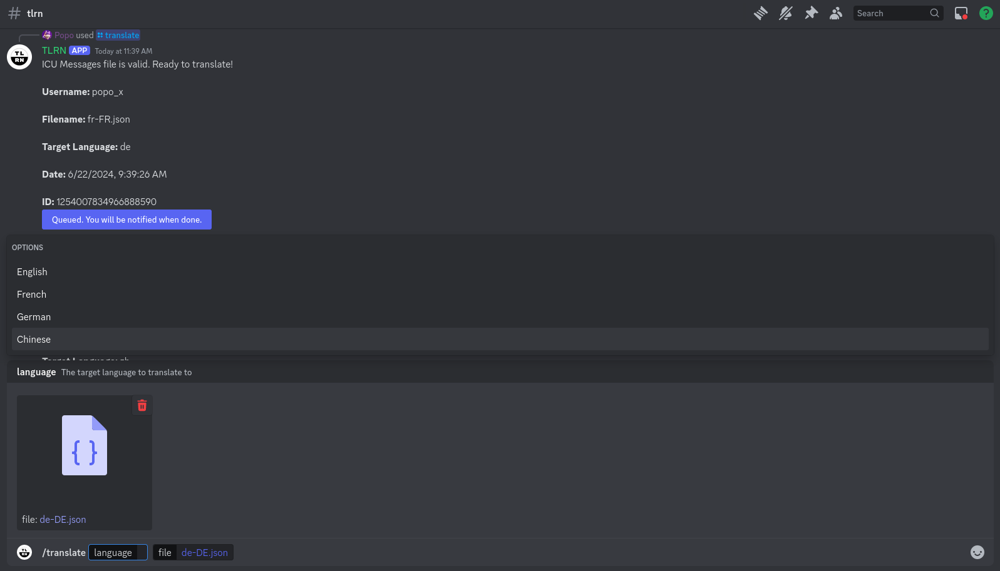
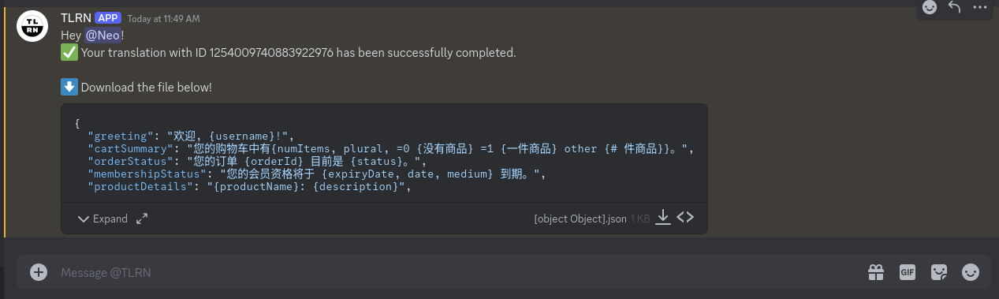

# TLRN Discord Bot

TLRN (Translate Right Now) is a Discord bot that simplify building i18n applications by providing a simple way to translate ICU messages to different languages.

## Features
One simple `/translate` command to translate JSON files to different languages.



The translation is done automatically by leveraging a fine-tuned language model that we run on our local machines. Once done, the bot will send a private message with the translated JSON file.



## Project structure

Below is a basic overview of the project structure:

```
├── src
│   ├── commands.js           -> JSON payloads for commands
│   ├── register.js           -> Sets up commands with the Discord API
│   ├── server.js             -> Discord app logic and routing
├── test
|   ├── test.js               -> Tests for app
├── wrangler.toml             -> Configuration for Cloudflare workers
├── package.json
├── README.md
├── .eslintrc.json
├── .prettierignore
├── .prettierrc.json
└── .gitignore
```

## Running locally

First clone the project:

```
git clone https://github.com/TranslateRN/tlrn-bot.git
```

Then navigate to its directory and install dependencies:

```
cd tlrn-bot
npm install
```

> ⚙️ The dependencies in this project require at least v18 of [Node.js](https://nodejs.org/en/)


### Register commands

The following command only needs to be run once:

```
$ npm run register
```

### Run app

Now you should be ready to start your server:

```
$ npm start
```

### Setting up ngrok

When a user types a slash command, Discord will send an HTTP request to a given endpoint. During local development this can be a little challenging, so we're going to use a tool called `ngrok` to create an HTTP tunnel.

```
$ npm run ngrok
```

This is going to bounce requests off of an external endpoint, and forward them to your machine. Copy the HTTPS link provided by the tool. It should look something like `https://8098-24-22-245-250.ngrok-free.app`. Update the interaction endpoint url in the Discord Developer Portal to use this URL.

This is the process we'll use for local testing and development. When you've published your bot to Cloudflare, you will _want to update this field to use your Cloudflare Worker URL._


### Storing secrets

The credentials in `.dev.vars` are only applied locally. The production service needs access to credentials from your app:

```
$ wrangler secret put DISCORD_TOKEN
$ wrangler secret put DISCORD_PUBLIC_KEY
$ wrangler secret put DISCORD_APPLICATION_ID
```
